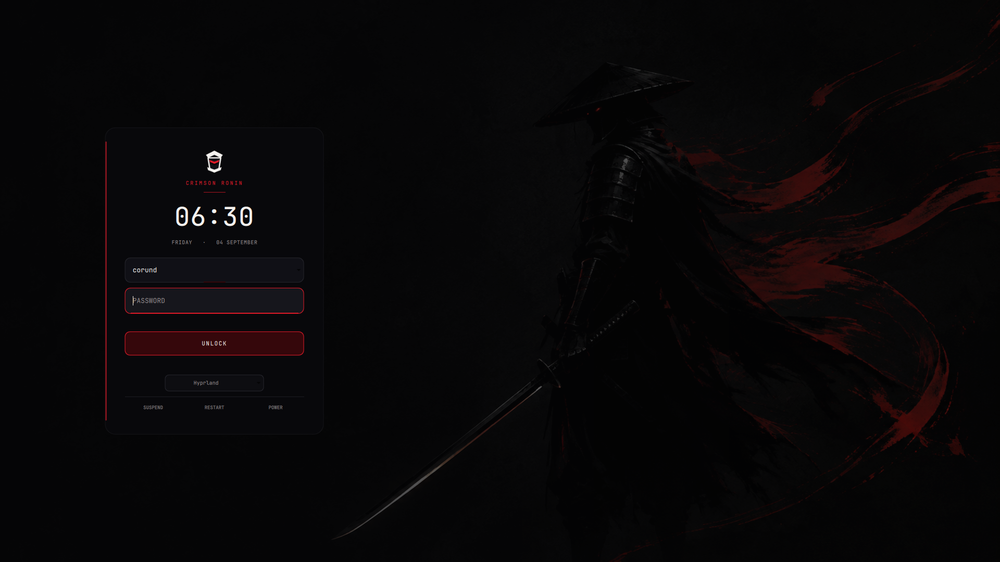

# Crimson Ronin

**Red–black liquid glass for Arch Linux + Hyprland.**

A focused creative/developer workstation built from smoked obsidian surfaces,
restrained crimson light, and Japanese cinematic composition. It keeps the
desktop practical: native Wayland, compact controls, opaque fullscreen games,
and no decorative background processes.

Release **0.1.0** targets x86_64 Arch Linux and Hyprland’s Lua configuration.



## What it installs

- Hyprland tuned for fast, non-bouncy motion at 144 Hz
- Caelestia Shell with its native left rail retained and recolored
- Ghostty as the default terminal
- Helium as the default browser, installed from its signed official tarball
- A permission-free Helium color/image theme with no access to websites
- Hyprlock and SDDM using the same cinematic wallpaper and visual language
- GTK 3/4, Qt6/Kvantum, Thunar, Fastfetch, Papirus-Dark, and matching fonts
- NetworkManager, PipeWire, Bluetooth, portals, clipboard history, and utilities
- Timestamped backups before user configuration is replaced

## Install on an existing Arch system

Run this as your normal sudo-capable user:

```bash
git clone https://github.com/jonahchang207/crimson-ronin.git ~/.local/share/crimson-ronin
cd ~/.local/share/crimson-ronin
./boot.sh
```

The guided menu offers a complete install, a theme-only refresh, repository
verification, and the full Arch ISO path. Nothing is piped directly into a
shell, so the code can be reviewed before it runs.

For scripting:

```bash
./install.sh --dry-run --yes
./install.sh --theme-only
./install.sh --skip-helium --skip-sddm
```

## Install Arch and Crimson Ronin

Boot the official Arch Linux ISO, connect to the network, then run:

```bash
pacman -Sy --needed git
git clone https://github.com/jonahchang207/crimson-ronin.git /root/crimson-ronin
cd /root/crimson-ronin
./install-arch.sh
```

The script launches Arch’s official `archinstall --advanced` interface for all
disk, filesystem, encryption, bootloader, locale, hostname, networking, and
user-account decisions. Crimson Ronin never partitions a disk itself. After
Archinstall completes, the repository is staged for the installed user and the
console prints the one command needed to install the desktop after reboot.

See [the installation guide](docs/INSTALL.md) for the full flow and recovery
instructions.

## Design constraints

- Approximately 80% black/graphite, 15% crimson, and 5% blade white
- Crimson is an active edge and status color, not a background fill
- No RGB gradients, fake hacker UI, random kanji, or permanent visual effects
- Blur is compositor-driven and intentionally modest for high-refresh displays
- Fullscreen clients are opaque and undecorated
- The included monitor profile is exactly `DP-1, 1920x1080@144`

Change the monitor line in `config/hypr/hyprland.lua` before installing on a
different display. Never raise this repository’s default to 180 Hz.

## Key workflow

| Binding | Action |
|---|---|
| `Super + Enter` | Ghostty |
| `Super + Shift + Enter` | Helium |
| `Super + Space` | Caelestia launcher |
| `Super + E` | Thunar |
| `Super + Q` / `Super + W` | Close window |
| `Super + F` | Fullscreen |
| `Super + T` | Float |
| `Super + 1–0` | Workspace |
| `Super + Shift + 1–0` | Move and follow |
| `Super + Ctrl + L` | Lock |

## Maintenance

```bash
bin/crimson-doctor
bin/crimson-update
bin/crimson-restore
```

`crimson-restore` restores only user configuration from a selected timestamped
backup. The previous SDDM configuration is preserved separately at
`/etc/sddm.conf.before-crimson-ronin`.

## License

MIT. See [LICENSE](LICENSE).
